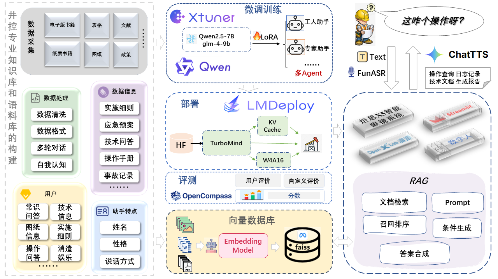

# Well_Master

## 📢介绍

**Well_Master 井控大师**——**关于井控知识的多模态大模型**


## 🎉 NEWS

- [2024.10.18] 创建项目，从今天开始啦~后续不断完善项目和文档
- [2024.10.21] 构建v1版数据集，包括井控书籍中的选择题、钻井井控技术问答、钻井设备问答和钻井液工艺技术问答

- [2024.10.22] 语音识别ASR和语音合成TTS接口完成


## 🛠 架构图



## 🧭 详细指南

### 1. 环境搭建

```bash
# 安装依赖
pip install torch==2.0.1 torchvision==0.15.2 torchaudio==2.0.2

# 其他python依赖
pip install transformers==4.36.2
pip install streamlit==1.24.0
pip install sentencepiece==0.1.99
pip install einops==0.8.0
pip install accelerate==0.33.0

# 安装微调框架Xtuner,通过源码下载安装
git clone -b v0.1.21  https://github.com/InternLM/XTuner /root/code/XTuner
# 进入源码目录，执行安装
cd Xtuner && pip install -e '.[deepspeed]'
# 验证安装结果
xtuner version
xtuner help

```

### 2. 微调数据准备

需要将自己的数据转换为 `xtuner` 的数据格式

```json
# 多轮对话数据格式
{
    "conversation":[
        {
            "system": "xxx",
            "input": "xxx",
            "output": "xxx"
        },...,
        {
            "input": "xxx",
            "output": "xxx"
        }
    ]
}

# 单论对话数据格式
{
    "conversation":[
        {
            "system": "xxx",
            "input": "xxx",
            "output": "xxx"
        }
    ]
}
```


### 3. 模型准备

要进行微调或者RAG，首先要下载合适的基础大模型（合适的意思主要就是模型大小是不是你的机器能跑起来），可以从 [**魔搭社区 (modelscope.cn**)](https://www.modelscope.cn/my/overview) 或者 [**Hugging Face **](https://huggingface.co/) 官网去下载想要的基座模型
